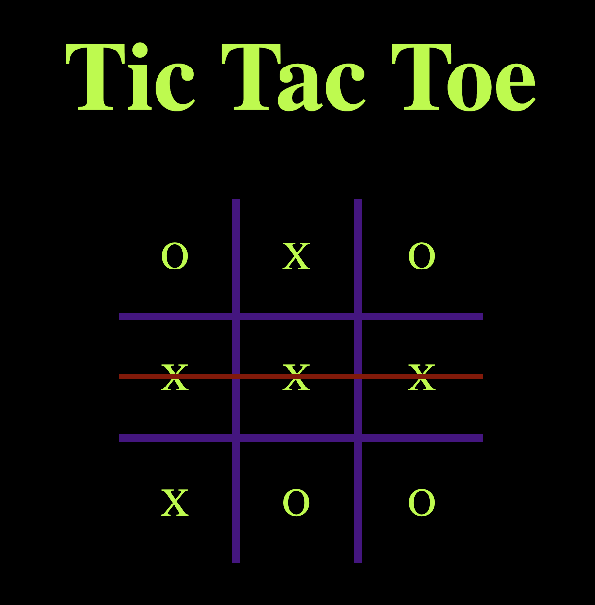

# Tic Tac Toe

CSS topics such as: How to create a Tic Tac Toe board using CSS grid layout. Css positioning with absolute. We will also be using flex layout in several areas of the application.

JavaScript topics such as: How to access and manipulate HTML elements from JavaScript, Arrow functions, destructuring objects, event handling(click event), arrays, adding sound via the Audio class and much more.
